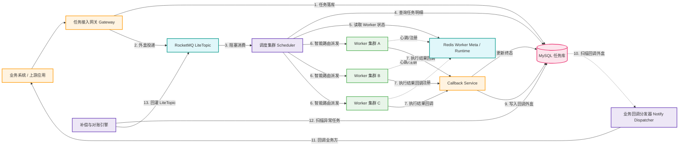

# RocketMQ LiteTopic 架构方案

## 1. 文档定位

本文给出一套基于 `RocketMQ 5.x LiteTopic` 的异步任务调度平台架构方案，作为当前 `A+` 方案的增强版与理想版对照方案。

本文重点回答以下问题：

- 当基础设施允许使用 `LiteTopic` 时，如何简化当前调度架构
- 如何利用 `LiteTopic` 降低 `HOL` 风险和二级调度复杂度
- 与当前 `RocketMQ 一级缓冲 + Redis 二级逻辑调度` 方案相比，边界、收益与成本分别是什么

本方案适用于：

- 已具备 `RocketMQ 5.x` 能力
- 可以使用 `LiteTopic`
- 希望降低自研调度复杂度
- 希望在海量 `tenantId + taskType` 组合维度下，进一步降低物理队列膨胀与 `HOL` 风险

---

## 2. 方案结论

当 `LiteTopic` 可用时，推荐将当前 `A+` 方案进一步简化为：

- `MySQL`：任务事实存储、状态机、外盒、回调外盒、补偿基线
- `RocketMQ LiteTopic`：主调度入口、逻辑隔离、海量堆积、主消费通道
- `Redis`：Worker 注册信息、最新运行态、少量执行态辅助缓存
- `Scheduler`：阻塞消费 LiteTopic 并直接完成路由与派发

一句话结论：

**LiteTopic 方案的本质是：让 MQ 本身承担更多“逻辑隔离 + 高基数队列抽象”的职责，从而弱化甚至取消 Redis 二级逻辑调度层。**

---

## 3. 为什么 LiteTopic 更适合这个场景

当前平台面临的核心问题是：

- `tenantId + taskType` 组合维度多
- 不同租户下同名 `taskType` 不能混淆
- 大租户热点任务容易引发 `HOL`
- 纯 Redis 二级逻辑调度虽然可行，但需要额外维护 `ready / processing / retry / active keys`

`LiteTopic` 的价值在于：

- 支持更轻量的逻辑主题抽象
- 比传统 Topic/Queue 更适合高基数逻辑隔离场景
- 能显著降低“为隔离而建设大量物理队列”的成本
- 使调度器可以更直接地消费“按逻辑维度隔离后的消息流”

因此，使用 `LiteTopic` 后，平台可以从：

- `RocketMQ 一级缓冲 + Redis 二级逻辑调度 + Pump/Dispatcher 分层`

简化为：

- `LiteTopic 主入口调度 + Worker 状态感知路由 + MySQL 补偿兜底`

---

## 4. 总体架构设计

### 4.1 逻辑架构图



### 4.2 分层说明

- 接入层：`Gateway`
- 存储层：`MySQL`
- 调度层：`RocketMQ LiteTopic + Scheduler`
- 执行层：`Worker`
- 通知层：`Callback Service + Notify Dispatcher`
- 观测层：`Prometheus + Grafana + ELK`

---

## 5. 核心设计原则

1. **让 MQ 尽量承担逻辑隔离**
   - 利用 `LiteTopic` 降低自建二级逻辑队列的复杂度

2. **调度器只做调度，不再做二次搬运**
   - `Scheduler` 直接从 LiteTopic 消费并完成派发

3. **Worker 状态与任务状态解耦**
   - Worker 最新运行态在 `Redis`
   - 任务事实与状态机在 `MySQL`

4. **最终一致性优先**
   - 任务提交成功后必须至少执行一次
   - 对 MQ 投递、Worker 回调、业务回调均具备补偿闭环

5. **逻辑隔离优先于物理隔离**
   - 不追求每个租户/任务类型独享一个传统物理 Topic
   - 借助 `LiteTopic` 提供更低成本的逻辑隔离能力

---

## 6. 核心链路设计

### 6.1 任务提交链路

1. 业务系统调用 `Gateway`
2. Gateway 完成鉴权、幂等校验、参数校验
3. Gateway 写 MySQL 任务表，状态为 `INIT`
4. Gateway 写入入队外盒表
5. 外盒投递线程将任务发送到 `RocketMQ LiteTopic`
6. 投递成功后，任务状态推进为 `QUEUED`
7. Gateway 返回 `taskId`

### 6.2 调度派发链路

1. `Scheduler` 以 Consumer Group 方式阻塞消费 LiteTopic
2. 读取消息后按 `taskId` 回源 MySQL 查询完整任务详情
3. 根据 `tenantId + taskType + tag + workerGroup` 选择目标 Worker Group
4. 读取 Redis 中的 Worker 运行态
5. 按 `Least Active + availableSlots + 健康度` 选择具体 Worker
6. 派发任务，并携带 `dispatchToken`
7. Worker 接单成功后，状态推进为 `RUNNING`

### 6.3 Worker 回调链路

1. Worker 执行结束后回调 `Callback Service`
2. 平台校验 `dispatchToken`、期望状态和幂等状态
3. 更新 MySQL 中的终态
4. 若配置了业务回调，则写入业务回调外盒
5. `Notify Dispatcher` 异步回调业务方

### 6.4 补偿链路

1. `Compensator` 周期扫描 MySQL 中长时间异常状态任务
2. 对于 MQ 丢失、回调异常、执行超时等场景，决定是否重试或重灌 LiteTopic
3. 超过最大重试次数则进入死信

---

## 7. LiteTopic 方案下如何治理 HOL

### 7.1 先说结论

`LiteTopic` 不能从理论上彻底消灭所有 `HOL`，但它可以：

- 显著降低传统 Topic/Queue 模式下的物理隔离成本
- 让“按组合维度隔离消息流”变得更容易
- 让平台少维护一层 Redis 二级逻辑队列

### 7.2 具体治理思路

1. **按逻辑维度组织消息**
   - 优先按 `tenantId + taskType` 或业务上更稳定的逻辑维度组织消息流

2. **调度器消费后仍做资源感知路由**
   - MQ 决定“读到谁”
   - 平台决定“派给谁”

3. **热点组合键做限额与降权**
   - 单组合键最大并发数
   - 单组合键失败率熔断
   - 单组合键最大重试风暴抑制

4. **重试与补偿分离主流量**
   - 重试、死信、回调重试必须通过独立逻辑通道隔离

### 7.3 与 A+ 的差异

- `A+`：通过 Redis 二级逻辑调度层做最终公平裁决
- `LiteTopic`：尽可能把逻辑隔离前置到 MQ 层，弱化二级调度层

也就是说：

- `A+` 更重控制面
- `LiteTopic` 更重 MQ 能力

---

## 8. Worker 管理设计

当前版本延续轻量 Worker 方案：

- Worker 启动后直连平台注册
- Redis 保存 Worker 注册信息与最新运行态
- Prometheus 保存历史监控指标
- Scheduler 基于 Redis 状态视图做调度决策

推荐 Redis Key：

```text
ats:worker:group:{workerGroup}
ats:worker:meta:{workerId}
ats:worker:runtime:{workerId}
```

Scheduler 派发前的筛选顺序：

1. 剔除 `DOWN / DRAINING / BLOCKED`
2. 剔除 `availableSlots <= 0`
3. 剔除资源过高或错误率异常节点
4. 在候选节点中按 `Least Active` 派发

---

## 9. 数据职责边界

### 9.1 MySQL

负责：

- 任务事实表
- 状态机流转
- 入队外盒
- 回调外盒
- 回调日志
- 死信与补偿记录

### 9.2 RocketMQ LiteTopic

负责：

- 主任务入口
- 海量缓冲与削峰
- 高基数逻辑隔离
- 可选生命周期事件与延迟重试消息

### 9.3 Redis

负责：

- Worker 注册元数据
- Worker 最新运行态
- 小规模执行态辅助缓存

### 9.4 Prometheus

负责：

- Worker CPU / 内存 / RT / 错误率趋势
- Scheduler 派发成功率
- MQ 堆积与消费速率
- 告警与容量规划

---

## 10. 高可用设计

### 10.1 控制面

- Gateway：无状态多实例
- Scheduler：无状态多实例，Consumer Group 自动接管
- Callback Service：多实例
- Notify Dispatcher：多实例
- Compensator：多实例但需保证任务级幂等

### 10.2 基础设施

- RocketMQ：建议 Broker 主从或 DLedger 模式
- Redis：建议 Cluster 模式
- MySQL/TiDB：建议高可用部署

### 10.3 失败场景

#### Scheduler 宕机

- Consumer Group 自动完成消费接管
- 未完成状态依赖 MySQL + 补偿链路恢复

#### Worker 宕机

- 心跳超时标记 `DOWN`
- 超时扫描器将长时间 `RUNNING` 的任务标记为 `TIMEOUT` 或重试

#### 回调失败

- 业务回调走回调外盒重试
- 超过阈值进入回调死信

---

## 11. 与当前 A+ 方案对比

| 维度 | LiteTopic 方案 | 当前 A+ 方案 |
| --- | --- | --- |
| 主入口缓冲 | RocketMQ LiteTopic | RocketMQ 标准版 |
| 二级调度层 | 可弱化或取消 | Redis 二级逻辑队列必须存在 |
| HOL 风险 | 较低 | 中等，需要二级公平调度层治理 |
| 自研复杂度 | 更低 | 更高 |
| 对 MQ 能力依赖 | 更强 | 中等 |
| 对 Redis 依赖 | 更轻 | 更重 |
| 适用性 | 基础设施更成熟时优先 | 无 LiteTopic 时的务实方案 |

---

## 12. 适用场景与建议

### 12.1 推荐使用 LiteTopic 的场景

- 可以稳定使用 `RocketMQ 5.x LiteTopic`
- 希望降低调度层自研复杂度
- 任务量大、逻辑隔离维度多
- 不希望长期维护 Redis 二级 ready / processing / retry 队列体系

### 12.2 不推荐直接切 LiteTopic 的场景

- 当前公司基础设施仍是 `RocketMQ 4.x`
- 团队对 `RocketMQ 5.x` 运维经验不足
- 当前项目更关注快速上线，而不是一步到位升级基础设施

### 12.3 最终建议

- **若 LiteTopic 可稳定使用，优先选择 LiteTopic 方案**
- **若受成本或基础设施限制无法使用，则继续采用当前 A+ 方案**

---

## 13. 最终结论

在 `LiteTopic` 可用的前提下，推荐将集团级异步任务调度平台设计为：

**MySQL 事实存储 + RocketMQ LiteTopic 主缓冲与逻辑隔离 + Scheduler 直接消费派发 + Redis Worker 状态视图 + 外盒与补偿闭环**

该方案相比当前 A+ 方案的主要收益是：

- 更低的调度控制面复杂度
- 更少的 Redis 二级逻辑调度维护成本
- 更适合高基数逻辑隔离场景
- 更接近“MQ 主调度、平台主路由”的理想形态

---

## 14. 参考资料

- RocketMQ 官方文档：<https://rocketmq.apache.org/docs/>
- RocketMQ 5.x 文档：<https://rocketmq.apache.org/docs/domainModel/02topic/>
- Redis 官方文档：<https://redis.io/docs/latest/>
- MySQL 官方文档：<https://dev.mysql.com/doc/>
