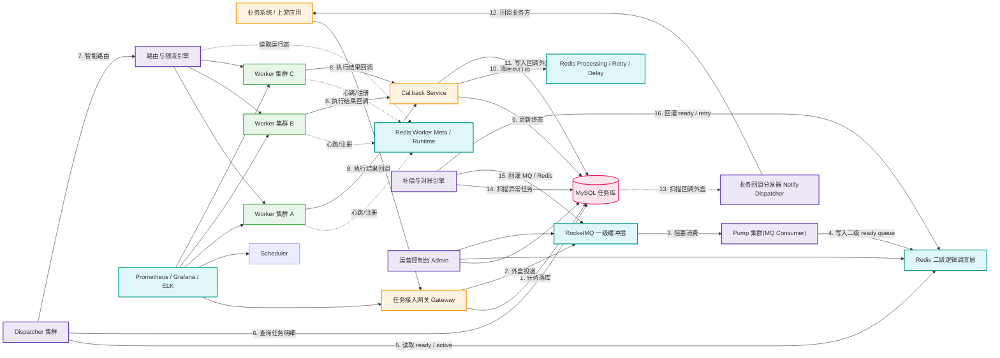

# 集团级异步任务调度中台系统架构方案

## 1. 文档目标

本文给出一套可直接落地的企业级异步任务调度基础设施架构方案，满足以下前提：

- 不能使用 RocketMQ 5.x LiteTopic
- 保留 `tenantId` 维度，但所有租户同权处理，不做差异化调度
- 任务接收与执行彻底解耦
- 无单点、高吞吐、支持海量任务积压与智能路由
- 目标可用性 `99.99%`
- 优先控制研发周期，尽量复用成熟基础设施，避免全栈自研

本文方案采用：

- `MySQL` 作为任务事实存储与补偿基线
- `RocketMQ 标准版` 作为一级缓冲层与主入口削峰通道
- `Redis` 作为二级逻辑调度层与 Worker 状态视图
- 自研薄层 `Gateway + Scheduler(Pump/Dispatcher) + Worker SDK + Admin`

该方案本质上是一个：

- `RocketMQ 一级缓冲 + Redis 二级逻辑调度`
- `统一租户规则`
- `按 tenantId + taskType 组合维度调度与路由`
- `存储与排队分离`
- `多组件高可用协同`

的生产级系统架构。

***

## 2. 总体设计原则

### 2.1 设计原则

1. **存储、缓冲与调度分层**
   - MySQL 负责持久化、状态流转、审计与补偿
   - RocketMQ 负责一级缓冲、削峰与海量堆积
   - Redis 负责二级逻辑调度、执行中状态与 Worker 状态视图
2. **接入与执行解耦**
   - 网关只负责接收、校验、落库、入队
   - 调度器只负责提取、路由、派发、重试
   - Worker 只负责执行与回调
3. **按组合维度建逻辑队列，保留租户同权**
   - Redis 二级 ready / processing / retry 队列按 `tenantId + taskType` 组合维度区分
   - 不做 VIP、权重、配额等租户差异化治理
   - 所有组合键使用统一调度规则与统一资源治理规则
4. **统一规则，按组合维度路由**
   - 当前阶段调度仍不做租户差异化
   - 但必须基于 `tenantId + taskType + tag + workerGroup` 唯一确定调度与执行路径
5. **全链路无单点**
   - Gateway、Scheduler、Worker、Admin 全部无状态集群化部署
   - Redis、MySQL、RocketMQ 均采用高可用集群
6. **最终一致性优先**
   - 调度链路允许短暂重复，不允许静默丢失
   - 通过幂等、重试、补偿、死信确保最终完成

***

## 3. 系统架构总览

### 3.1 逻辑架构图



### 3.2 部署视角

系统拆分为六层：

- 接入层：`Gateway`
- 一级缓冲层：`RocketMQ`
- 二级调度层：`Pump + Dispatcher + Redis`
- 执行层：`Worker`
- 存储层：`MySQL`
- 治理层：`Admin + Observability`

***

## 4. 核心模块职责

### 4.1 Gateway

职责：

- 提供统一任务提交 API
- 参数校验、鉴权、限流、幂等校验
- 写入 MySQL 任务表与入队外盒表
- 将任务通过外盒可靠投递到 RocketMQ 一级缓冲层
- 在需要时发布任务生命周期事件

特点：

- 无状态，可水平扩容
- 不承担实际执行和复杂调度逻辑
- 请求成功返回 `taskId`，实现同步转异步
- 通过外盒重发表机制解决 MySQL 与 RocketMQ 之间的最终一致性

### 4.2 Scheduler

职责：

- 由 `Pump` 从 RocketMQ 阻塞消费任务并快速搬运到 Redis 二级逻辑队列
- 由 `Dispatcher` 从 Redis 二级 ready queue 中公平选择待派发任务
- 查询 MySQL 获取完整任务上下文
- 根据 `tenantId + taskType + tag + workerGroup` 做智能路由
- 基于 Worker 运行状态视图选择可用节点
- 控制派发并发、超时、重试、失败回收
- 维护执行中状态和延迟重试状态

特点：

- 调度内核拆分为 `Pump + Dispatcher` 两层
- `Pump` 只做快搬运，不直接做公平派发
- `Dispatcher` 只做公平调度与资源感知派发
- 通过二级逻辑队列和公平轮询避免热点组合键长期霸占调度资源

### 4.3 Worker

职责：

- 真正执行业务任务
- 遵循统一执行协议和回调协议
- 支持幂等消费
- 支持超时中断或超时上报
- 支持接单 ACK、运行心跳、完成回调
- 定时向平台上报心跳、并发槽位和资源水位
- 启动时直连平台完成注册，不依赖独立注册中心

特点：

- 按 `taskType` 分组部署，必要时支持对特定 `tenantId + taskType` 做独立扩缩容
- 支持独立扩缩容
- 统一接入 Worker SDK，降低业务方接入成本
- 平台对其采用“主动上报 + 被动探测 + Redis 状态视图”的组合感知机制

### 4.4 Compensator

职责：

- 扫描长时间异常状态任务
- 回收执行超时任务
- 对账 Redis 与 MySQL 的偏差
- 推动重试或标记失败

特点：

- 低频运行
- 只兜底，不承担主调度职责

### 4.5 Notify Dispatcher

职责：

- 异步扫描业务回调外盒
- 按业务方配置发起 HTTP/gRPC 回调
- 负责签名、重试、退避、超时控制与结果落账
- 对连续失败的回调转入回调死信，等待人工处理

特点：

- 与任务主链路解耦，业务方回调失败不影响任务终态写入
- 基于外盒与回调日志实现至少一次通知
- 可按租户或业务系统维度配置回调地址、密钥和重试策略

### 4.6 Admin

职责：

- 查询任务全生命周期
- 人工重试、人工终止、人工补偿
- 查看失败原因、执行耗时、重试轨迹
- 查看租户维度、任务类型维度的运行报表

***

## 5. 数据流与主链路设计

### 5.1 任务提交链路

1. 上游系统调用 `Gateway`
2. Gateway 完成参数校验、租户校验、幂等校验
3. Gateway 向 MySQL 插入任务记录，状态为 `INIT`
4. Gateway 同时写入入队外盒表，状态为 `NEW`
5. Gateway 根据任务类型和分桶规则将任务发布到 RocketMQ 一级缓冲层
6. RocketMQ 投递成功后，将任务状态推进为 `QUEUED`，并将外盒状态推进为 `SENT`
7. 若 MQ 投递失败，则由外盒重发表后台线程异步补发
8. Gateway 返回 `taskId`

设计要求：

- MySQL 落库必须先于 RocketMQ 投递
- 对外成功响应必须建立在任务可补偿的前提下
- 即使 RocketMQ 短暂失败，也必须依赖外盒重发表而不是仅依赖内存态补偿
- 同一 `taskId` 多次投递必须幂等，重复消息不允许在二级逻辑队列中造成重复派发

### 5.2 调度派发链路

1. `Pump` 以 Consumer Group 方式阻塞消费 RocketMQ
2. `Pump` 根据 `tenantId + taskType` 将任务快速写入 Redis 二级 ready queue
3. `Pump` 激活对应组合键，并唤醒 `Dispatcher`
4. `Dispatcher` 被唤醒后，不直接派触发方任务，而是按全局公平策略选择本轮待派发组合键
5. `Dispatcher` 通过 Lua 脚本将任务从 ready queue 原子转入 `processing zset`
6. `Dispatcher` 查询 MySQL 获取任务详情
7. 按 `tenantId + taskType + tag + workerGroup` 选择目标 Worker 集群
8. 派发到 Worker 执行，并携带 `dispatchToken`
9. Worker 接单成功后回 ACK，任务状态推进为 `RUNNING`
10. 若仅完成派发但未收到 Worker ACK，则任务状态保持 `DISPATCHED`

### 5.3 执行回调链路

1. Worker 通过独立的 `Callback Service` 回传执行结果
2. Callback 校验任务版本、`dispatchToken`、期望状态和幂等状态
3. 若执行成功，则更新 MySQL 状态为 `SUCCESS`
4. 若执行失败且允许重试，则更新 MySQL 状态为 `RETRY_WAIT`
5. 若执行失败且不允许重试，则更新 MySQL 状态为 `FAILED`
6. 若超过最大重试次数，则更新为 `DEAD_LETTER`
7. 从 Redis `processing zset` 中删除该任务
8. 若状态为 `RETRY_WAIT`，则写入 `retry zset`
9. 若任务配置了业务回调，则写入“业务回调外盒表”，等待异步通知业务方

回调裁决要求：

- 所有终态不可逆
- 晚到回调只能记录审计日志，不能覆盖新状态
- 回调必须携带 `dispatchToken`，只有当前有效执行令牌才允许改写状态

### 5.3.1 平台回调业务方链路

Worker 回调平台只表示“平台已经拿到执行结果”，并不等于“业务方已经收到结果通知”。

因此必须把“平台内结果落账”和“平台对业务方回调”拆成两条链路：

1. Worker 回调 `Callback Service`
2. 平台先完成任务终态写库、执行态清理、重试/死信判断
3. 若任务配置了业务回调地址，则平台写入“业务回调外盒表”，状态置为 `NEW`
4. `Notify Dispatcher` 异步扫描回调外盒，调用业务方回调地址
5. 业务方返回成功确认后，将回调状态更新为 `SUCCESS`
6. 若业务方超时、返回失败码或网络异常，则按退避策略重试
7. 超过最大回调次数仍失败，则转入“回调死信”

这样设计的核心原则是：

- 任务执行结果落账优先，业务通知异步化
- 业务方回调失败不能阻塞任务主链路
- 平台必须能区分“任务执行成功”与“结果通知成功”

### 5.3.2 业务回调外盒与通知状态

建议单独维护业务回调外盒与回调日志，至少包含：

- `taskId`
- `tenantId`
- `callbackUrl`
- `callbackPayload`
- `callbackStatus`
- `retryCount`
- `nextRetryTime`
- `lastErrorCode`
- `lastErrorMsg`
- `signType`
- `traceId`

建议的回调状态如下：

```text
NEW -> SENDING -> SUCCESS
             \-> RETRY_WAIT -> SENDING
             \-> DEAD
             \-> CANCELLED
```

说明：

- `SUCCESS` 表示业务方已成功确认收到
- `DEAD` 表示达到最大回调次数仍未成功
- `CANCELLED` 表示任务被人工取消后不再通知业务方

### 5.3.3 业务回调协议要求

平台回调业务方时，建议强制要求以下协议：

- 请求必须携带 `taskId`
- 请求必须携带 `tenantId`
- 请求必须携带任务终态、执行时间、失败原因等摘要信息
- 请求必须携带 `traceId`
- 请求必须携带签名字段与时间戳，防止伪造请求
- 业务方必须返回标准确认码，例如 `code=0`

平台侧需要支持：

- 回调超时配置
- 指数退避 + 抖动重试
- 单租户或单业务系统回调熔断
- 回调地址灰度切换
- 回调签名密钥轮换

### 5.3.4 业务回调失败补偿

业务方回调失败的补偿策略必须独立于任务重试策略，不能混用。

推荐规则：

- 任务执行失败是否重试，由任务调度状态机决定
- 任务已终态后，业务回调失败仅影响“通知状态”，不回退任务终态
- 平台可以对回调失败做多次异步补发
- 补发仍失败时进入回调死信，由运营平台人工重发或人工确认

一句话总结：

`Worker -> 平台` 是执行结果回传链路，`平台 -> 业务方` 是通知分发链路，两者必须解耦。

### 5.4 补偿恢复链路

1. Compensator 周期扫描 MySQL 中异常任务
2. 找出长期 `QUEUED`、`DISPATCHED`、`RUNNING` 的任务
3. 检查 RocketMQ 与 Redis 二级逻辑调度层中是否存在对应任务
4. 若确认丢失或超时，则重新回灌 MQ 或 Redis 二级调度层，或标记死信

同时还需要扫描：

- 长期停留在 `INIT` 且外盒状态不是 `SENT` 的任务
- 长期停留在 `RETRY_WAIT` 且未进入 `retry zset` 的任务
- 长期停留在 `DISPATCHED` 且未收到 Worker ACK 的任务
- 长期停留在“业务回调外盒 `RETRY_WAIT`”但未继续补发的通知记录

### 5.5 Pump / Dispatcher 协同调度机制

在 A+ 方案中，任务调度拆成两层：

- **Pump**：负责从 RocketMQ 快速搬运任务到 Redis 二级逻辑队列
- **Dispatcher**：负责从 Redis 二级逻辑队列中按公平策略派发任务

这样设计的原因是：

- 利用 RocketMQ 承接海量堆积和一级削峰
- 利用 Redis 二级逻辑队列承接 `tenantId + taskType` 组合维度的公平调度
- 避免直接依赖 MQ 物理队列顺序而产生严重 HOL
- 让“搬运”和“派发”两类职责解耦

#### 5.5.1 Pump 工作机制

`Pump` 以 Consumer Group 方式阻塞消费 RocketMQ，不直接执行业务派发，而是快速把任务拆分到 Redis 二级逻辑队列。

推荐流程：

1. 从 RocketMQ 某个 Topic/Queue 阻塞读取任务
2. 根据 `tenantId + taskType` 计算目标二级逻辑队列
3. 写入 `dispatch:ready:{tenantId}:{taskType}`
4. 激活 `dispatch:active:keys`
5. 发出一次轻量唤醒信号，通知 `Dispatcher` 可以开始新一轮调度

说明：

- Pump 只负责快搬运，不负责公平裁决
- MQ 物理队列只承担缓冲入口，不承担最终公平调度

#### 5.5.2 Dispatcher 触发机制

`Dispatcher` 不是被业务接口直接调用，也不是“谁触发就直接派谁”，而是：

- 常驻调度循环
- 事件唤醒为主
- 短周期兜底扫描为辅

推荐触发源包括：

- Pump 新写入二级 ready queue
- Worker 可用容量恢复
- RetryMover 回灌重试任务
- Compensator 回灌补偿任务

但必须强调：

- **触发只负责唤醒 Dispatcher**
- **真正派发顺序必须由 Dispatcher 按全局公平策略统一裁决**

#### 5.5.3 二级逻辑队列模型

Redis 二级逻辑队列建议至少包括：

```text
dispatch:ready:{tenantId}:{taskType}
dispatch:processing:{tenantId}:{taskType}
dispatch:retry:{tenantId}:{taskType}
dispatch:active:keys
```

其中：

- `ready` 保存待派发任务
- `processing` 保存已领取但未完成任务
- `retry` 保存延迟重试任务
- `active:keys` 保存当前有待调度任务的活跃组合键

这种设计使得 MQ 中共享物理队列造成的 HOL 风险，被收敛到 Redis 二级逻辑调度层中继续做公平裁决。

#### 5.5.4 Dispatcher 派发策略

`Dispatcher` 被唤醒后，不直接派发触发方任务，而是执行一轮统一调度：

1. 读取 `dispatch:active:keys`
2. 筛选当前有待派发任务的组合键
3. 筛选有可用 Worker 资源的 `workerGroup`
4. 按公平算法选择本轮应派发的组合键
5. 从对应 `ready queue` 原子领取任务并转入 `processing`
6. 回源 MySQL 获取任务明细
7. 结合 Worker 状态视图完成路由与派发

推荐策略：

- 基础策略：`Round Robin`
- 增强策略：`Deficit Round Robin`
- 保护策略：单组合键单轮配额、最大并发上限、失败降权、临时暂停领取

#### 5.5.5 原子领取与执行中管理

Dispatcher 不能直接裸执行 `RPOP`，而应通过 Lua 脚本完成“从 ready 出队 + 写入 processing”的原子操作。

推荐逻辑：

1. 从 `dispatch:ready:{tenantId}:{taskType}` 弹出一个 `taskId`
2. 若成功，则写入 `dispatch:processing:{tenantId}:{taskType}`
3. `score` 设置为执行超时时间戳
4. 返回 `taskId`

说明：

- 这样可以避免“任务刚出二级 ready queue 就因调度器宕机而丢失”
- 执行超时后可以从 `processing` 回收

#### 5.5.6 HOL 治理策略

方案 A 的核心风险是 MQ 物理队列内部的队头阻塞。A+ 方案通过以下方式治理：

1. **固定桶分片**
   - RocketMQ 不按租户无限建 Topic/Queue
   - 而是按固定数量 Queue 分片
   - `bucket = hash(tenantId + taskType) % N`

2. **Pump 快速搬运**
   - 尽快把任务从 MQ 物理队列搬到 Redis 二级逻辑队列

3. **Redis 二级公平调度**
   - 最终派发顺序由 `Dispatcher` 在逻辑队列层统一裁决

4. **热点治理**
   - 单组合键单轮配额
   - 单组合键并发上限
   - 失败风暴降权

结论上，A+ 方案不能让 MQ 物理层完全零 HOL，但可以在工程上将 HOL 降到可接受水平。

#### 5.5.7 重试与补偿回灌

待调度任务来源不只来自 MQ，也来自：

- RetryMover 回灌
- Compensator 回灌

推荐规则：

1. 新任务优先进入 RocketMQ 一级缓冲层
2. 重试任务优先进入 `dispatch:retry:{tenantId}:{taskType}`
3. 到期后由 RetryMover 回灌到 `dispatch:ready:{tenantId}:{taskType}`
4. 补偿任务按场景回灌 RocketMQ 或 Redis 二级逻辑队列
5. 每次回灌后都要激活 `dispatch:active:keys`

#### 5.5.8 推荐实现建议

建议采用如下方式实现 A+ 方案：

- RocketMQ：一级缓冲与主入口削峰
- Pump：阻塞消费 MQ 并快速搬运
- Redis ready / processing / retry：二级逻辑调度层
- Dispatcher：事件唤醒 + 短周期兜底扫描
- 公平算法：`Round Robin` 起步，逐步演进到 `DRR`
- Worker 路由：基于 Redis 中的 Worker 运行态视图
- 补偿恢复：由 Compensator 扫描 MySQL 后回灌 MQ 或 Redis

一句话总结：

**A+ 方案不是“MQ 直接消费即派发”，而是“RocketMQ 一级缓冲，Pump 快速搬运，Dispatcher 在 Redis 二级逻辑队列上做公平派发”。**

***

## 6. 任务状态机设计

建议采用如下状态机：

```text
INIT -> QUEUED -> DISPATCHED -> RUNNING -> SUCCESS
 |        |           |            \-> RETRY_WAIT -> QUEUED
 |        |           |            \-> FAILED
 |        |           |            \-> DEAD_LETTER
 \-> CANCELLED        \-> CANCELLED
```

### 6.1 状态说明

- `INIT`
  - 任务已接收，已落库，尚未成功入队
- `QUEUED`
  - 已成功进入调度队列，等待 Scheduler 派发
- `DISPATCHED`
  - 已被调度器领取，并发往 Worker
- `RUNNING`
  - Worker 已确认接收并开始执行
- `SUCCESS`
  - 执行成功，任务终态
- `FAILED`
  - 执行失败但不再重试，任务终态
- `RETRY_WAIT`
  - 等待重试窗口到达
- `DEAD_LETTER`
  - 超过最大重试次数或被人工判定为毒任务
- `CANCELLED`
  - 被人工或系统取消，任务终态

### 6.2 状态流转原则

- 状态推进必须幂等
- 回调更新必须带条件，例如基于 `version` 或 `expectedStatus`
- 所有终态不可逆
- 允许重复派发，但必须阻止重复成功写入
- 失败可重试时只能进入 `RETRY_WAIT`，不能直接进入 `FAILED`
- 任务终止必须区分 `QUEUED`、`DISPATCHED`、`RUNNING` 三种状态分别处理

***

## 7. MySQL、RocketMQ 与 Redis 的职责边界

### 7.1 MySQL 职责

MySQL 保存：

- 完整任务元数据
- 任务状态流转
- 重试次数
- 执行结果
- 失败原因
- 审计信息
- 租户信息
- 业务回调外盒与回调日志

MySQL 是：

- 最终事实源
- 对账源
- 补偿源

### 7.2 RocketMQ 职责

RocketMQ 保存：

- 新任务主入口消息
- 一级缓冲消息
- 物理分桶消息
- 延迟事件与可选生命周期事件

RocketMQ 是：

- 一级削峰层
- 海量堆积层
- Pump 的阻塞消费来源

### 7.3 Redis 职责

Redis 保存：

- 按 `tenantId + taskType` 维度拆分的二级 ready 队列
- 执行中集合
- 延迟重试集合
- 活跃组合键索引
- Worker 注册信息与最新运行态

Redis 是：

- 二级逻辑调度层
- 短期执行态缓存
- Worker 实时状态视图
- Dispatcher 公平调度的核心缓存层

### 7.4 推荐 Key 设计

```text
dispatch:ready:{tenantId}:{taskType}
dispatch:processing:{tenantId}:{taskType}
dispatch:retry:{tenantId}:{taskType}
dispatch:active:keys
ats:worker:group:{workerGroup}
ats:worker:meta:{workerId}
ats:worker:runtime:{workerId}
```

说明：

- 当前阶段虽然所有租户同权，但 Redis 二级逻辑队列必须按 `tenantId + taskType` 区分
- 这样可以避免不同租户下相同 `taskType` 的任务混淆、串扰和执行态冲突
- 调度策略仍然统一，不因为租户不同而采用不同权重或优先级
- `tenantId` 既是业务归属字段，也是队列定位字段和补偿定位字段
- `dispatch:active:keys` 是全局活跃组合键发现索引，不按组合键单独建 active key
- 对高基数场景必须增加空闲组合键清理、活跃窗口和内存上限治理
- 业务回调外盒建议放在 MySQL，不建议放在 Redis 中做长期通知持久化

***

## 8. 智能路由设计

### 8.1 当前阶段路由原则

智能路由不做租户差异化治理，但路由计算必须包含以下维度：

- `tenantId`
- `taskType`
- `tag`
- `workerGroup`
- `任务资源属性`，如 CPU 密集型、IO 密集型、外部调用型

### 8.2 路由流程

1. Scheduler 获取任务明细
2. 根据 `tenantId + taskType` 确定逻辑任务通道，再匹配执行器组
3. 根据实时负载选择目标 Worker 节点
4. 若目标组不可用，则进入降级路由或延迟重试

### 8.3 路由策略建议

- 默认使用 `Least Active`
- 对外部依赖重的任务类型设置独立 Worker Group
- 对重任务与轻任务分池，避免资源争抢
- 对同名 `taskType` 的不同租户任务，必须通过组合键路由避免串队列
- 对失败率过高的任务类型触发熔断

## 9. Worker 状态上报与资源感知机制

为了让 `Scheduler` 正确选择可用 Worker，平台必须同时掌握两个事实：

- 这个 Worker 是谁，归属于哪个 `workerGroup`
- 这个 Worker 此刻还能不能接单

当前版本不引入独立注册中心，采用更轻量的三层组合方式：

- **Worker 直连平台注册**：Worker 启动时调用平台注册接口写入 Redis 元数据
- **Worker 主动心跳上报**：Worker 定时上报最新运行态到 Redis
- **平台被动探测**：平台做超时摘除和健康检查兜底
- **Prometheus 监控历史**：长期趋势、告警和容量分析交给监控系统

一句话原则：

**Redis 保存 Worker 注册信息和最新运行态，Prometheus 保存时序监控，Scheduler 只消费平台维护好的实时状态视图。**

### 9.1 为什么当前不需要独立注册中心

当前阶段的 Worker 管理目标是：

- 让 Worker 能被平台发现
- 让 Scheduler 能快速拿到可派发节点
- 让运维能看到趋势与告警

这些目标可以通过“平台接口 + Redis + Prometheus”完成，不必额外引入独立注册中心。

这样做的收益是：

- 简化系统架构
- 减少组件数量
- 降低控制面维护成本
- 缩短第一版实现周期

### 9.2 总体模式

推荐采用三层组合模式：

1. **Worker 启动注册**
   - 通过平台注册接口写入 Worker 元数据
   - 让平台知道该实例属于哪个 `workerGroup`、支持哪些 `taskType`

2. **Worker 主动心跳上报**
   - 上报应用态运行指标
   - 是调度决策的主要依据

3. **平台被动健康探测**
   - 校验 Worker 是否假死或网络隔离
   - 是摘除异常实例的兜底手段

4. **统一状态视图缓存**
   - 平台将元数据和运行态汇总到 Redis
   - Scheduler 高频读取 Redis 而不是直接探测 Worker

### 9.3 Worker 启动注册

每个 Worker 启动后，先调用平台注册接口完成注册，再进入可派发状态。

建议接口：

```text
POST /worker/register
```

建议注册内容包括：

- `workerId`
- `workerGroup`
- `ip`
- `port`
- `protocol`
- `version`
- `supportedTaskTypes`
- `tags`
- `maxConcurrency`

平台处理逻辑：

1. 校验 `workerId` 是否合法
2. 校验 `workerGroup` 与 `supportedTaskTypes` 配置
3. 将 Worker 元数据写入 Redis
4. 将该 Worker 加入所属 `workerGroup` 的候选列表
5. 初始化运行态为 `UP` 或 `DRAINING`

推荐 Redis Key：

```text
ats:worker:group:{workerGroup}
ats:worker:meta:{workerId}
```

其中：

- `ats:worker:group:{workerGroup}` 保存当前组下 Worker 列表
- `ats:worker:meta:{workerId}` 保存单实例注册元数据

### 9.4 Worker 主动心跳上报

每个 Worker 实例建议按固定周期向平台上报一次运行状态，推荐心跳间隔：

- `3s ~ 5s`

建议提供统一接口：

```text
POST /worker/heartbeat
```

建议心跳内容至少包括：

- `workerId`
- `workerGroup`
- `ip`
- `port`
- `version`
- `supportedTaskTypes`
- `status`
- `cpuUsage`
- `memoryUsage`
- `loadAverage`
- `activeTaskCount`
- `maxConcurrency`
- `availableSlots`
- `avgRt`
- `successRate`
- `errorRate`
- `lastHeartbeatTime`

其中最关键的是：

- `activeTaskCount`
- `maxConcurrency`
- `availableSlots`
- `avgRt`
- `errorRate`

因为这些字段直接影响调度决策。

平台接收心跳后的处理逻辑：

1. 校验该 Worker 是否已注册
2. 更新 `ats:worker:runtime:{workerId}` 中的最新运行态
3. 刷新心跳时间戳与可派发状态
4. 将关键指标暴露给 Prometheus
5. 必要时更新该 Worker 在 `workerGroup` 候选集中的可用标记

推荐 Redis Key：

```text
ats:worker:runtime:{workerId}
```

### 9.5 Worker 状态定义

平台建议统一维护以下 Worker 运行状态：

- `UP`
  - 正常可接单
- `DEGRADED`
  - 资源吃紧，允许降速接单
- `DRAINING`
  - 优雅下线，不再接收新任务
- `DOWN`
  - 不可用
- `BLOCKED`
  - 被平台熔断或人工封禁

状态流转建议：

- Worker 正常启动后进入 `UP`
- 资源超阈值时进入 `DEGRADED`
- 优雅下线时先进入 `DRAINING`
- 心跳超时或探测失败时进入 `DOWN`
- 连续错误率过高时可进入 `BLOCKED`

### 9.6 平台被动探测

除 Worker 主动心跳外，平台仍需做被动探测，主要用于处理：

- Worker 进程假死
- 网络隔离
- 心跳线程卡死
- 上报逻辑异常

建议至少包含以下两类机制：

1. **心跳超时摘除**
   
   - 例如超过 `15s` 未收到心跳，则将 Worker 标记为 `DOWN`

2. **健康检查接口**
   
   - HTTP `/health`
   - gRPC health check
   - 或平台内部探活联动

平台侧原则：

- 心跳是主判断依据
- 被动探测是兜底补充

### 9.7 Worker 状态视图的存储分工

建议按“注册信息、实时快照、监控历史”三层拆分：

#### 9.7.1 Redis

保存：

- Worker 实例注册元数据
- Worker 最近一次运行态快照
- Worker Group 下的可用实例索引

用途：

- 供 Scheduler 高频读取
- 供平台做 Worker 候选集合管理
- 降低每次路由都访问任务库的开销

推荐 Key 示例：

```text
ats:worker:group:{workerGroup}
ats:worker:meta:{workerId}
ats:worker:runtime:{workerId}
```

其中：

- `ats:worker:group:{workerGroup}` 保存组下 Worker 列表
- `ats:worker:meta:{workerId}` 保存注册信息
- `ats:worker:runtime:{workerId}` 保存单实例最新运行快照

#### 9.7.2 Prometheus

保存：

- CPU
- 内存
- GC
- 网络
- RT
- 错误率
- 成功率
- 心跳成功率
- `availableSlots`

用途：

- 监控
- 告警
- 容量规划

这样分工的原因是：

- Redis 适合保存高频变更的最新状态
- Prometheus 适合保存长期时序指标
- 当前版本不需要单独保存 Worker 状态历史到 MySQL

### 9.8 Scheduler 如何使用 Worker 状态

`Scheduler` 不应在每次派发时直接请求 Worker，而应使用平台维护好的状态视图进行决策。

推荐筛选流程：

1. **先筛掉不可派发节点**
   
   - `DOWN`
   - `DRAINING`
   - 心跳超时
   - 已被熔断的 `BLOCKED` 节点

2. **再筛掉资源不足节点**
   
   - `availableSlots <= 0`
   - `cpuUsage` 超阈值
   - `memoryUsage` 超阈值
   - `errorRate` 超阈值

3. **最后在候选节点中做负载均衡**
   
   - `Least Active`
   - `availableSlots` 最大优先
   - 同机房优先
   - 同版本优先

这意味着 `Scheduler` 做的不是“找活着的节点”，而是“找当前最适合接任务的节点”。

### 9.9 优雅上下线机制

Worker 下线时，不能直接把实例从平台摘掉，建议分两步：

1. Worker 主动上报状态为 `DRAINING`
2. Scheduler 停止对该节点派发新任务
3. Worker 执行完当前任务后再下线
4. 平台最终将其标记为 `DOWN`

这样可以避免：

- 节点准备退出时仍收到新任务
- 任务执行中被强制中断

### 9.10 异常场景处理

#### 9.10.1 心跳中断

- 超过阈值未收到心跳
- 平台将 Worker 标记为 `DOWN`
- Scheduler 停止派单

#### 9.10.2 资源过高

- `cpuUsage` 或 `memoryUsage` 持续过高
- 平台将 Worker 标记为 `DEGRADED`
- Scheduler 降低其调度优先级或暂停派单

#### 9.10.3 错误率飙高

- 平台将 Worker 标记为 `BLOCKED`
- 进入自动或人工熔断恢复流程

#### 9.10.4 心跳正常但执行阻塞

若 Worker 心跳正常，但：

- `activeTaskCount` 长期不下降
- `avgRt` 持续升高
- 超时率明显升高

则平台应判定其进入“软异常”状态，并降低派单权重。

### 9.11 推荐落地方式

生产上建议采用如下组合：

- `Worker Register API`：维护 Worker 注册信息
- `Worker Heartbeat API`：维护应用态运行指标
- `Redis`：维护 Worker 注册信息与最新运行态
- `Prometheus`：维护监控与告警

一句话总结：

**Worker 直连平台注册，Redis 看“最新状态”，Prometheus 看“历史趋势”，Scheduler 依赖 Redis 中的聚合运行视图做调度。**

***

## 10. 高可用设计

### 10.1 无单点设计

所有自研节点均采用集群部署：

- Gateway：至少 `2` 实例
- Scheduler：至少 `3` 实例
- Worker：按业务组多实例部署
- Admin：至少 `2` 实例

基础设施采用高可用集群：

- MySQL：主从或 MGR / InnoDB Cluster
- Redis：推荐统一使用 `Redis Cluster` 生产模式
- RocketMQ：NameServer 多节点 + Broker 主从

### 10.2 故障场景处理

#### 场景一：Gateway 宕机

- LB 自动摘除故障节点
- 其他 Gateway 接管流量
- 不影响已提交任务执行

#### 场景二：Scheduler 宕机

- RocketMQ Consumer Group 自动完成 Pump 消费接管
- 其他 Dispatcher 实例继续从 Redis 二级逻辑队列接管派发
- `processing zset` 中任务继续等待超时回收

#### 场景三：Worker 宕机

- 执行超时后由补偿线程回收
- 重试或转死信

#### 场景四：Redis 异常

- 进入降级模式
- Pump 暂停向 Redis 二级逻辑队列搬运任务
- RocketMQ 继续承担一级缓冲，避免任务入口丢失
- Dispatcher 暂停派发或仅处理已持有的少量本地任务
- Compensator 在 Redis 恢复后按分页和限速策略重建二级逻辑队列

#### 场景五：RocketMQ 异常

- Gateway 仅落 MySQL 与外盒表，暂停实时投递
- 外盒线程在 RocketMQ 恢复后批量补发
- Redis 二级逻辑队列继续消化已搬运任务

#### 场景六：MySQL 主切换

- 依赖数据库高可用组件自动切换
- Gateway 与 Scheduler 使用连接池自动重连

### 10.3 99.99% 可用性要求

达到 `99.99%` 的前提：

- 所有关键服务至少双实例
- 所有关键基础设施采用高可用集群
- 回调链路、补偿链路、重试链路都必须可自动恢复
- 全链路具备熔断、限流、降级、告警

***

## 11. 吞吐与扩展设计

### 11.1 水平扩容点

可以独立扩容的组件：

- Gateway
- Pump
- Dispatcher
- Worker
- Redis
- RocketMQ Consumer Group

### 11.2 高吞吐保障手段

1. MySQL 仅作为事实库，不承担高频轮询
2. RocketMQ 承担一级缓冲和海量堆积，不直接做最终公平调度
3. Redis 只存二级逻辑队列、执行态和 Worker 运行态，不存大 payload
4. Pump 采用批量消费与快速搬运，Dispatcher 采用批量领取、批量查库、批量派发
5. Worker 按任务类型分池，调度面按 `tenantId + taskType` 做任务隔离
6. 重试采用延迟队列，避免失败风暴
7. 对高基数组合键必须做活跃窗口清理与空闲 Key 回收

### 11.3 建议的批量策略

- RocketMQ 批量消费：`50 ~ 200`
- Redis ready queue 批量领取：`20 ~ 100`
- MySQL 批量查询：`IN` 批次 `50 ~ 200`
- RPC 批量派发：按任务类型控制在 `10 ~ 50`

***

## 12. 一致性与幂等设计

### 12.1 一致性原则

系统采用最终一致性，不追求分布式强事务。

核心原则：

- 允许消息重复，不允许静默丢失
- 允许状态延迟，不允许终态混乱

### 12.2 幂等要求

以下操作必须幂等：

- Gateway 提交任务
- Scheduler 派发任务
- Worker 执行任务
- Callback 写回结果
- Notify Dispatcher 回调业务方
- Compensator 重新入队

### 12.3 推荐幂等手段

- 任务唯一键：`bizKey + taskType + tenantId`
- 请求幂等键：`requestId`
- 状态更新带 `version`
- Worker 执行带 `dispatchToken`
- 回调落库带条件更新
- 重复提交时必须返回已有 `taskId`
- 平台回调业务方必须携带 `callbackId` 或 `notifyId` 作为通知幂等键

***

## 13. 运维与可观测设计

### 13.1 核心监控指标

必须监控：

- 任务提交 TPS
- 入队成功率
- 调度延迟
- Worker 执行耗时
- 成功率 / 失败率 / 重试率
- 死信量
- RocketMQ Topic / Queue 堆积深度
- Redis 组合队列积压
- MySQL 慢 SQL
- 各 `taskType` 吞吐与失败率
- 各 `tenantId` 提交量与异常量
- 各 `tenantId + taskType` 组合键的积压量、延迟与失败率
- Worker 心跳成功率、可用实例数、`availableSlots` 水位、`DEGRADED/BLOCKED` 节点数
- 业务方回调成功率、平均耗时、重试次数、死信量

### 13.2 告警建议

- Redis 组合队列积压超过阈值
- 某 `taskType` 连续失败率升高
- 某 `tenantId + taskType` 组合键失败率异常升高
- 回调超时率异常
- Worker 心跳中断或可用实例数低于阈值
- RocketMQ 堆积持续增长或消费停滞
- 业务方回调失败率异常升高
- 业务方回调死信量异常上涨
- MySQL 主从延迟过高
- Scheduler 无消费心跳
- 死信任务数异常上涨

### 13.3 运维能力

Admin 至少支持：

- 查询任务详情
- 任务重试
- 任务终止
- 强制转死信
- 查看状态流转轨迹
- 查看执行日志引用信息
- 查看外盒重发表状态与补偿记录
- 查看业务回调记录、回调死信与人工补发结果

***

## 14. 研发边界与自研建议

### 14.1 建议自研

- `task-gateway`
- `task-scheduler`
- `task-worker-sdk`
- `task-notify-dispatcher`
- `task-admin`
- `task-compensator`

### 14.2 直接复用

- `MySQL`
- `Redis`
- `RocketMQ 标准版`
- `Prometheus + Grafana`
- `ELK / Loki`

### 14.3 不建议当前阶段自研

- 自定义消息中间件
- 自定义注册中心
- 自定义分布式协调框架
- 复杂多租户调度策略引擎

***

## 15. 分阶段落地建议

### 15.1 Phase 1：最小生产可用版

先交付：

- 任务接入
- MySQL 持久化
- 入队外盒与重发表
- RocketMQ 一级缓冲
- Redis 二级逻辑调度队列
- Pump + Dispatcher 派发
- Worker 回调
- Callback Service
- 平台回调业务方
- Compensator
- 超时重试
- 死信处理
- 基础监控

### 15.2 Phase 2：增强版

再补齐：

- RocketMQ 生命周期事件总线
- 更细粒度路由策略
- 运营控制台
- 更完善的报表与告警
- 人工补偿与批量操作

### 15.3 Phase 3：平台化演进

未来再考虑：

- 租户分级治理
- 按租户限流与配额
- VIP Worker 池
- DAG 编排
- 跨机房双活调度

***

## 16. 最终结论

在“保留租户、租户同权处理、且不同租户下任务类型可能相同”的约束下，最务实且生产可落地的系统架构是：

**RocketMQ 一级缓冲 + Redis 二级逻辑调度 + Pump/Dispatcher 分层调度 + MySQL 事实存储 + Worker 分组执行 + 外盒重发表 + 补偿闭环兜底**

该方案的优点是：

- 不依赖 RocketMQ 5.x LiteTopic
- 无需一开始就建设重型多租户调度中台
- 可以实现任务接收与执行彻底解耦
- 可通过集群化部署做到无单点
- 可以支撑海量任务积压与横向扩容
- 保留未来向租户差异化治理演进的空间
- 利用 MQ 一级缓冲和 Redis 二级公平调度，在工程上显著降低 HOL 风险

***

## 17. 参考资料

- RocketMQ 官方文档：<https://rocketmq.apache.org/docs/>
- Redis 官方文档：<https://redis.io/docs/latest/>
- MySQL 官方文档：<https://dev.mysql.com/doc/>
- Prometheus 官方文档：<https://prometheus.io/docs/introduction/overview/>
